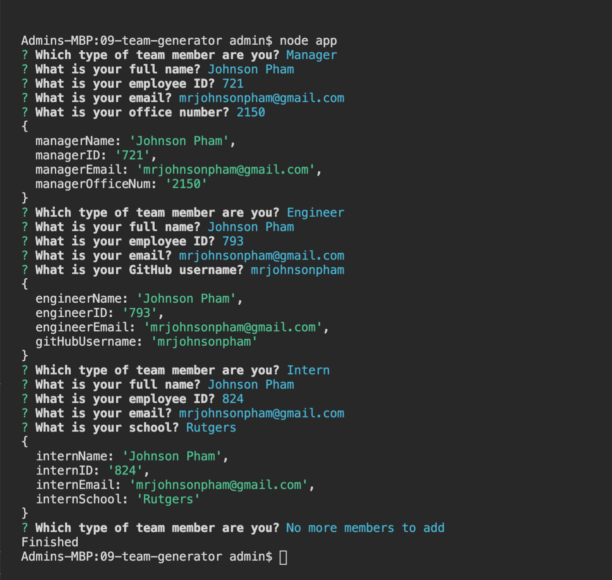
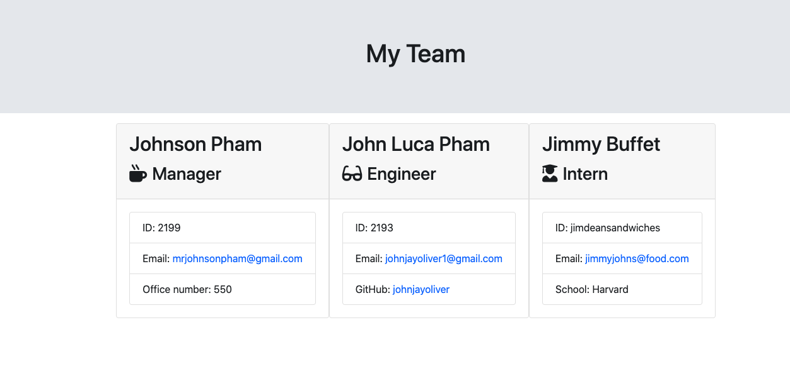

# 09-team-generator

Template Engine + Employee Summary

One of the most important aspects of programming is writing code that is readable, reliable, and maintainable. Here we are building a NODE CLI to take in information about employees and generate an HTML webpage that displays summaries for each person. Testing is a key piece in making code maintainable, this app has been ensured that all unit tests have pass.

##

### User input

The project must prompt the user to build an engineering team. An engineering
team consists of a manager, and any number of engineers and interns.

##

### Instructions
1. Using the command line application, please remember to install all package dependencies.
2. The application will prompt the user for information about the team manager and then information about the team members, please click each person's role respectively. 
3. The user can input may choose any number of team members, and they may be a mix of engineers and interns.
4. Once the user has filled out each prompt regarding their full name, position, employee ID, email, and or school then the application will have created a full team that will generate and create a HTML file that displays a nicely formatted team roster based on the information provided by the user. 

##

### Technology
NPM Packages: Require and Jest 

##

### License 
MIT 

##

### Important notes 
While creating this team roster what helped along was implementing and creating constructor classes that contained the following setup:  

  * Name

  * Role

  * ID

  * Role-specific property (School, link to GitHub profile, or office number)

After prompts are completed. 
The file is then rendered and written to the output directory where the new team.html is then created.
You now have yourself a new team roster ready to be displayed and shown off!

##

### Roster output

### Video Demonstration 
Please view video: https://drive.google.com/file/d/1o1k8fSNfw6poS89ADfzZ75pP35KeEONw/view?usp=sharing
